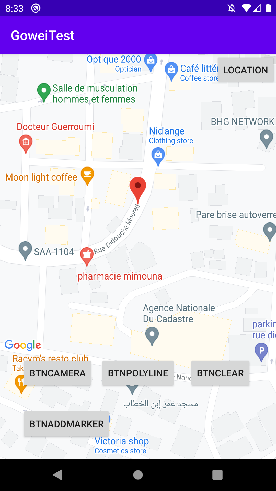
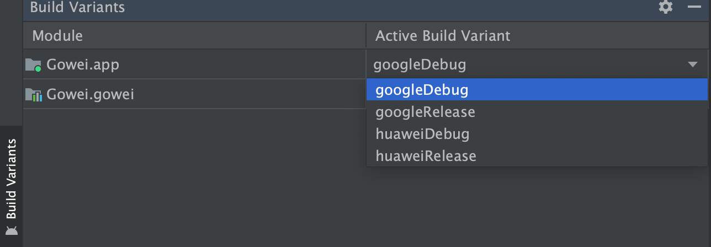

<h1 align="center">Gowei</h1></br>

<p align="center">
Gowei is a library that handles Maps & Location kit integration (Huawei, Google)
</p>
</br>
<p align="center">
  <a href="https://opensource.org/licenses/Apache-2.0"></a>
  <a href="https://android-arsenal.com/api?level=21"></a>
</p> <br>

<p align="center">

</p>


As you may now, if you try to run an application that use Google maps or use play services for location on a Huawei device, it won't work and vice versa.<br><br>
So by using Gowei, you'll just have to choose which flavor you want to build.


<p align="center">

</p>


## Including in your project
[](https://search.maven.org/search?q=g:%22com.appfiza.android%22%20AND%20a:%22gowei%22)

### Gradle 
Add below codes to your **root** `build.gradle` file (not your module build.gradle file).
```Gradle
allprojects {
    repositories {
        mavenCentral()
    }
}
```
And add a dependency code to your **module**'s `build.gradle` file.
```gradle
dependencies {
    implementation "com.appfiza.android:gowei:1.0.2"
}
```

In your **app** module's `build.gradle` file, add the following **flavors** 
```gradle
flavorDimensions "devices"
  productFlavors {
      huawei {
          dimension "devices"
      }
      google {
          dimension "devices"
      }
  }
```


## SETUP
Before starting using Gowei, you need to do some configurations.

### HUAWEI
Start by adding your app to **AppGallery Connect console**, check the following tutoriel [HMSPreparation](https://developer.huawei.com/consumer/en/codelab/HMSPreparation/index.html#0).

### GOOGLE
You have to get a key for your map by following this [Google Maps Platform](https://developers.google.com/maps/documentation/android-sdk/get-api-key).


## Usage

### Basic Example - Location
Here is a basic example of implementing Gowei **Location**<br>.


```kotlin
val goweiLocation = GoweiLocation()
goweiLocation.init(
  activity = this,
  rationalMessage = "Rational message",
  keepTracking = true,
  locationListener = object : YLocation.LocationListener {
     override fun onLocationFailed() {
  
    }

    override fun onLocationChanged(location: Location) {
     
    }
 })
```

And you need to add this to your **activity/fragment**

```kotlin
override fun onActivityResult(requestCode: Int, resultCode: Int, data: Intent?) {
    super.onActivityResult(requestCode, resultCode, data)
    goweiLocation.onActivityResult(requestCode, resultCode, data)
}

override fun onRequestPermissionsResult(
    requestCode: Int,
    permissions: Array<out String>,
    grantResults: IntArray
) {
    super.onRequestPermissionsResult(requestCode, permissions, grantResults)
    goweiLocation.onRequestPermissionsResult(requestCode, permissions, grantResults)
}
```

### Requesting location

```kotlin
goweiLocation.requestLocation()
```
### Stop requesting location
```kotlin
goweiLocation.stopRequestingLocation()
```

### Basic Example - Map
Here is a basic example of implementing Gowei **Map**<br>.

First thing you need to add this to your **layout** file
```XML
<include
    android:id="@+id/myMap"
    layout="@layout/gowei_map"
    android:layout_width="match_parent"
    android:layout_height="match_parent"/>
```

And in code

```kotlin
  val goweiMap = GoweiMap(activity = this, fragmentManager = supportFragmentManager)
  goweiMap.init()
```
And you need to use **setMapReadyListener** before doing anything

```kotlin
  goweiMap.setMapReadyListener {
      // Here your start doing things
      onMapReady()
  }
```

### Adding/Updating/Deleting markers
To add a marker, you just need an ID and the latitude and longitude, so for adding
```kotlin
goweiMap.addMarker("markerId_1", 36.763825, 3.048627)
```
Updating marker's position 
```kotlin
goweiMap.withMarker("markerId_1").position(36.763825, 3.048627)
```
Removing a marker
```kotlin
goweiMap.withMarker("markerId_1").remove()
```

### Animating camera
```kotlin
goweiMap.animateCamera(36.763825, 3.048627, 18F) // 18F is the camera zoom
```

And for more examples on how to integrate it and using it, please check the sample.
   
## Gowei Map methods
Here is all methods that Gowei Map has for now.

```kotlin
fun init()
fun isMarkerAvailable(markerID: String): Boolean
fun getTargetCameraPosition(): Position
fun enableMarkerClick()
fun disableMarkerClick()
fun animateCameraZoomBy(zoomBy: Float, zoom: Int)
fun animateCameraZoomIn(zoom: Int)
fun isScrollGesturesEnabled(): Boolean
fun setMarkerPositionListener(markerPositionListener: (Position) -> Unit)
fun setOnCameraIdleListener(cameraIdleListener: (() -> Unit))
fun setScrollGesturesEnabledDuringRotateOrZoom(enabled: Boolean)
fun setRotateGesture(enabled: Boolean)
fun setTiltGesturesEnabled(enabled: Boolean)
fun setCompassEnabled(enabled: Boolean)
fun setMyLocationButtonEnabled(enabled: Boolean)
fun setScrollGesturesEnabled(enabled: Boolean)
fun setZoomControlsEnabled(enabled: Boolean)
fun setAllGesturesEnabled(enabled: Boolean)
fun setMapType(mapType: Int)
fun setMapStyle(context: Context, resId: Int): Boolean
fun animateCamera(lat: Double, lng: Double, zoom: Float)
fun animateCameraWithBounds(positions: List<Position>, zoom: Int)
fun moveCamera(lat: Double, lng: Double, zoom: Float)
fun addPolyline(polylineEncoded: String, width: Float? = null, color: Int? = null)
fun setPadding(left: Int, top: Int, right: Int, bottom: Int)
fun clear()
```

# License
```xml
Copyright 2021 BackPackerDz (Fayçal Kaddouri)

Licensed under the Apache License, Version 2.0 (the "License");
you may not use this file except in compliance with the License.
You may obtain a copy of the License at

   http://www.apache.org/licenses/LICENSE-2.0

Unless required by applicable law or agreed to in writing, software
distributed under the License is distributed on an "AS IS" BASIS,
WITHOUT WARRANTIES OR CONDITIONS OF ANY KIND, either express or implied.
See the License for the specific language governing permissions and
limitations under the License.
```